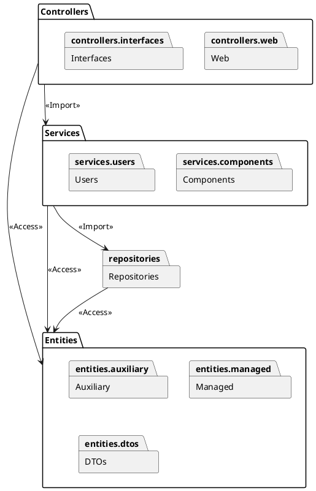
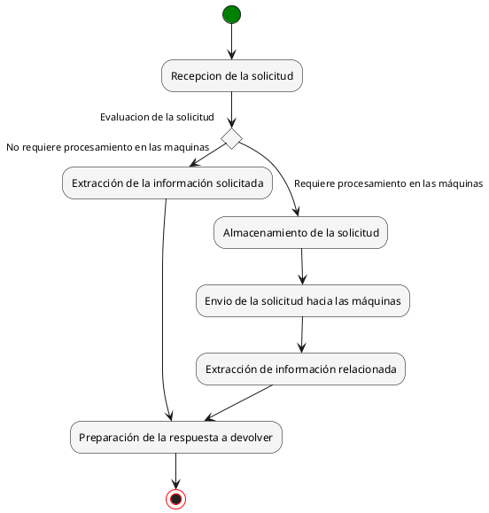
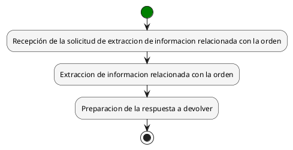

# Festo

This is the controller for the Festo machine.

Methods specification available in http://localhost:8080/swagger-ui.html

# Casos de Uso

```plantuml
@startuml Diagrama de Casos de uso

actor Administrador as admin
actor Profesor as teacher
actor Estudiante as student

rectangle "Manejo de productos" as product_management #LightGoldenRodYellow {
  usecase "Crear producto" as create_product #LightBlue
  usecase "Ver productos disponibles" as view_products_available #LightBlue
  usecase "Ver productos no disponibles" as view_products_unavailable #LightBlue
  usecase "Ver productos" as view_products #LightBlue
  usecase "Ver tipos de productos" as view_product_types #LightBlue
  usecase "Ver productos por tipo" as view_products_by_type #LightBlue
  usecase "Ver operaciones soportadas" as view_operations #LightBlue
  usecase "Ver pasos definidos" as view_steps #LightBlue
}

rectangle "Manejo de Clientes" as client_management #LightGreen {
  usecase "Ver los clientes registrados" as get_clients #LightBlue
  usecase "Registrar cliente" as register_client #LightBlue
}

rectangle "Manejo de planes de trabajo" as workplan_management #LightCoral {
  usecase "Crear plan de trabajo" as create_workplan #LightBlue
  usecase "Ver planes de trabajo" as get_workplans #LightBlue
  usecase "Ver tipos de planes de trabajo" as get_workplans_types #LightBlue
  usecase "Ver planes de trabajo por tipo" as get_workplans_by_type #LightBlue
}

rectangle "Estado de la produccion en la planta" as production_state #LightSkyBlue {
  usecase "Ver cola de producción" as get_production_orders #LightBlue
  usecase "Ver ordenes con final planeado" as get_production_orders_with_plannedend #LightBlue
  usecase "Ver ordenes con estados" as get_production_orders_with_status #LightBlue
  usecase "Ver ordenes filtradas por estados" as get_production_orders_filtered_by_status #LightBlue
  usecase "Ver indicadores de produccion de la planta" as get_production_indicators #LightBlue
  usecase "Llevar a cabo la produccion de una orden" as post_production_order #LightBlue
}

rectangle "Estado de las máquinas en la planta" as machine_status #LightGrey {
  usecase "Ver rendimiento de los equipos" as get_machines_status #LightBlue
  usecase "Ver rendimiento de los equipos para una máquina específica" as get_machine_status #LightBlue
  usecase "Ver fallas de los equipos" as get_machines_fails #LightBlue
  usecase "Ver fallas de los equipos para una maquina especifica" as get_machine_fails #LightBlue
}

admin --> view_products
admin --> view_product_types
admin --> view_products_by_type
admin --> view_products_available
admin --> view_products_unavailable
admin --> get_workplans
admin --> get_workplans_types
admin --> get_workplans_by_type
admin --> create_product
admin --> view_operations
admin --> view_steps
admin --> get_production_orders_with_status
admin --> get_production_orders_with_plannedend
admin --> get_production_orders_filtered_by_status
admin --> create_workplan
admin --> get_production_orders
admin --> get_production_indicators
admin -up-> register_client
admin -up-> get_clients
admin -up-> get_machines_status
admin -up-> get_machines_fails
admin -up-> get_machine_status
admin -up-> get_machine_fails

teacher -up-> view_products
teacher -up-> view_product_types
teacher -up-> view_products_by_type
teacher -up-> view_products_available
teacher -up-> view_products_unavailable
teacher -up-> get_workplans
teacher -up-> get_workplans_types
teacher -up-> get_workplans_by_type
teacher -up-> create_workplan
teacher -up-> view_operations
teacher -up-> view_steps
teacher -up-> get_production_orders_with_status
teacher -up-> get_production_orders_with_plannedend
teacher -up-> get_production_orders_filtered_by_status

student -up-> view_products_available
student -up-> view_products_by_type
student -up-> view_product_types
student -up-> get_production_orders_with_status
student -up-> get_production_orders_filtered_by_status
student --> post_production_order

@enduml
```


# Componentes


# Funcionamiento general


# Flujo de las ordenes
## Creacion
```plantuml
@startuml Order
skinparam ConditionStyle bold
skinparam activity {Enti
  StartColor green
  BarColor SaddleBrown
  EndColor red
  BackgroundColor WhiteSmoke
  BorderColor Black
  FontName Arial
}

start
:Creacion de la solicitud de producción de una orden;
:Almacenamiento de la solicitud;
fork
  :Envio de la orden a Step7 para que este coordine la ejecución con las máquinas;
fork again
  :Preparación de la respuesta a devolver;
end fork {and}
stop
@enduml
```
## Extraccion de información
